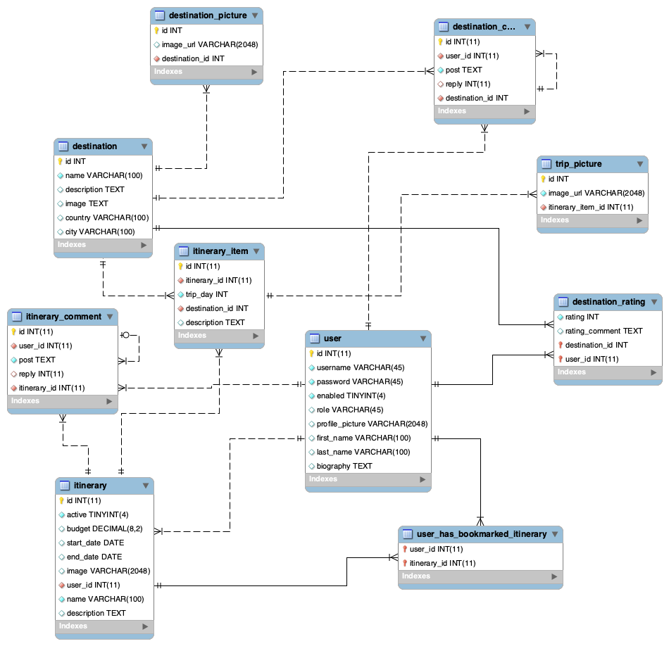

# MidtermProject
### Mid-term Team Project for Skill Distillery
## Team members and roles:

* Carlos Lobera (Developer, DBA)
* Ryan Goode (Developer, Scrum Master, Repo Owner)
* Forrest January (Developer)

## Overview
ItineraryShare is a social website to share itineraries. It allows users to interact with each other around their trip itineraries, as well as review and discuss specific destinations.

## Description
On the ItineraryShare website you are greeted and shown all active itineraries. As a guest user, you are able to view public data but cannot insert any data.

The user has the option to log in at the top right, which redirects the log in screen where you can create an account or log in.

As a verified user, you can create/update/delete/bookmark itineraries made by the logged in user. Also, a verified user can create/delete itinerary items for itineraries they created. The user can also add/delete pictures to the itinerary item.

As a verified user, you can create a destination. A user can also comment/rate/add pictures to a destination.

As a verified user, you can update/disable their own account.

As an admin can perform any user function on all users/destination/itineraries. An admin can also view all itineraries/users. An admin can delete any pictures.

Click <a href="http://18.232.244.192:8080/ItineraryShare/home.do">here</a> to view the website

## How to login, username/password, etc.
Username: admin
Password: chaotic_slime
## Implementation

## Technologies and Methodologies Used

Languages: Java, SQL
Web: HTML, CSS, Bootstrap
Frameworks: Hibernate, Spring Framework, Spring Boot
Methodologies: TDD, Agile

## Lessons Learned
* Trello keeps projects on track
* Pair-programming is mutually beneficial
* Programming is learned and improved by programming
* CSS and the Bootstrap framework are powerful tools
* Browser Dev Tools are your friend
* Stack traces are vital to fixing a program

## Stretch Goals
* Star rating system
* Filtering on landing page and search results page
* Allow itineraries to be copied to user’s account
* Responsive design for smaller screens
